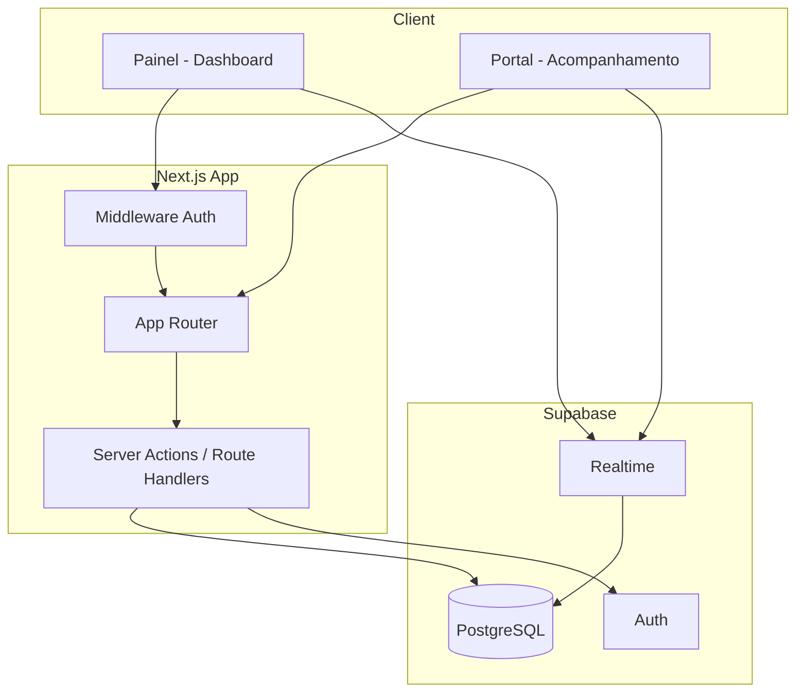

# Infraestrutura Base — Design

**Spec**: `.specs/features/infra-base/spec.md`
**Status**: Draft

---

## Architecture Overview

Monorepo Next.js com App Router separando rotas do painel (`/dashboard/*`) e portal público (`/acompanhar/[token]`). Supabase centraliza PostgreSQL, Auth e Realtime. Server Components para dados iniciais; Client Components apenas onde interatividade/Realtime é necessária.



---

## Code Reuse Analysis

### Existing Components to Leverage

| Component | Location | How to Use |
| --------- | -------- | ---------- |
| _Nenhum_ | — | Projeto greenfield |

### Integration Points

| System | Integration Method |
| ------ | ------------------ |
| Supabase PostgreSQL | `@supabase/supabase-js` + migrations SQL |
| Supabase Auth | `@supabase/ssr` cookies + middleware Next.js |
| Supabase Realtime | `supabase.channel().on('postgres_changes')` no portal |

---

## Components

### Supabase Client (Browser)

- **Purpose**: Cliente Supabase para componentes client-side (Realtime, auth client)
- **Location**: `src/lib/supabase/client.ts`
- **Interfaces**:
  - `createBrowserClient(): SupabaseClient` — singleton para browser
- **Dependencies**: `@supabase/ssr`, env vars `NEXT_PUBLIC_SUPABASE_URL`, `NEXT_PUBLIC_SUPABASE_ANON_KEY`
- **Reuses**: Padrão oficial Supabase + Next.js App Router

### Supabase Client (Server)

- **Purpose**: Cliente Supabase para Server Components e Server Actions
- **Location**: `src/lib/supabase/server.ts`
- **Interfaces**:
  - `createServerClient(): Promise<SupabaseClient>` — lê cookies da sessão
- **Dependencies**: `next/headers`, `@supabase/ssr`
- **Reuses**: Padrão oficial Supabase SSR

### Auth Middleware

- **Purpose**: Proteger rotas `/dashboard/*` e refresh de sessão
- **Location**: `src/middleware.ts`
- **Interfaces**:
  - Middleware Next.js interceptando rotas protegidas
- **Dependencies**: `@supabase/ssr`
- **Reuses**: Template Supabase auth helpers

### Database Migrations

- **Purpose**: Versionar schema e RLS
- **Location**: `supabase/migrations/`
- **Interfaces**:
  - Arquivos SQL incrementais aplicados via Supabase CLI
- **Dependencies**: Supabase CLI
- **Reuses**: Convenção Supabase migrations

---

## Data Models

### workshops

```typescript
interface Workshop {
  id: string // uuid, PK
  name: string
  phone: string | null
  created_at: string // timestamptz
  updated_at: string
}
```

**Relationships**: 1:N com `service_orders`; 1:N com usuários auth (via `workshop_id` em metadata ou tabela `workshop_users`)

### workshop_users

```typescript
interface WorkshopUser {
  id: string // uuid, PK — matches auth.users.id
  workshop_id: string // FK → workshops
  role: 'admin' | 'technician'
  created_at: string
}
```

### service_orders

```typescript
interface ServiceOrder {
  id: string // uuid, PK
  workshop_id: string // FK → workshops
  order_number: string // ex: "OS-2026-0042", unique per workshop
  public_token: string // uuid, unique globally — usado no link público
  customer_name: string
  customer_phone: string
  device: string // tipo: smartphone, notebook, etc.
  brand: string
  model: string
  reported_issue: string
  status: ServiceOrderStatus
  created_at: string
  updated_at: string
}

type ServiceOrderStatus =
  | 'received'
  | 'in_analysis'
  | 'in_repair'
  | 'waiting_parts'
  | 'ready_pickup'
  | 'delivered'
```

### status_history

```typescript
interface StatusHistory {
  id: string
  service_order_id: string // FK → service_orders
  from_status: ServiceOrderStatus | null
  to_status: ServiceOrderStatus
  changed_by: string | null // FK → auth.users
  created_at: string
}
```

### order_notes

```typescript
interface OrderNote {
  id: string
  service_order_id: string // FK → service_orders
  content: string
  created_by: string | null
  created_at: string
}
```

---

## RLS Policies (Resumo)

| Tabela | Política | Regra |
| ------ | -------- | ----- |
| workshops | SELECT | Usuário autenticado vê apenas sua workshop |
| service_orders | ALL | CRUD apenas ordens da workshop do usuário |
| status_history | SELECT (auth) | Histórico das ordens da workshop |
| status_history | SELECT (anon) | Histórico via `public_token` validado |
| order_notes | ALL (auth) | CRUD notas das ordens da workshop |
| order_notes | SELECT (anon) | Leitura via ordem com token válido |

---

## Error Handling Strategy

| Error Scenario | Handling | User Impact |
| -------------- | -------- | ----------- |
| Supabase offline | Try/catch + toast/página erro | "Serviço temporariamente indisponível" |
| Sessão expirada | Middleware redirect | Redireciona ao login com aviso |
| Env vars ausentes | Fail fast no boot | Log claro no terminal |
| Migration falhou | Abort + mensagem CLI | Desenvolvedor corrige SQL |

---

## Tech Decisions

| Decision | Choice | Rationale |
| -------- | ------ | --------- |
| Monorepo vs. split | Monorepo Next.js | Painel e portal compartilham tipos e componentes |
| Auth strategy | Supabase Auth email/password | Simples para MVP; OAuth futuro |
| Realtime vs. polling | Supabase Realtime | Requisito de "tempo real"; polling como fallback implícito no reconnect |
| Migrations | Supabase CLI SQL | Versionamento nativo; RLS no mesmo arquivo |
| UI components | shadcn/ui | Acessível, customizável, sem lock-in de component library |

---

## Environment Variables

```bash
# .env.local (exemplo)
NEXT_PUBLIC_SUPABASE_URL=https://xxx.supabase.co
NEXT_PUBLIC_SUPABASE_ANON_KEY=eyJ...
SUPABASE_SERVICE_ROLE_KEY=eyJ...  # apenas server-side, nunca expor
NEXT_PUBLIC_APP_URL=http://localhost:3000
```

---

## Directory Structure (Proposta)

```
agendafix/
├── src/
│   ├── app/
│   │   ├── (auth)/login/
│   │   ├── (dashboard)/dashboard/
│   │   ├── acompanhar/[token]/
│   │   └── layout.tsx
│   ├── components/ui/          # shadcn
│   ├── lib/supabase/
│   └── types/database.ts       # gerado ou manual
├── supabase/
│   ├── migrations/
│   └── config.toml
├── .specs/
└── package.json
```
