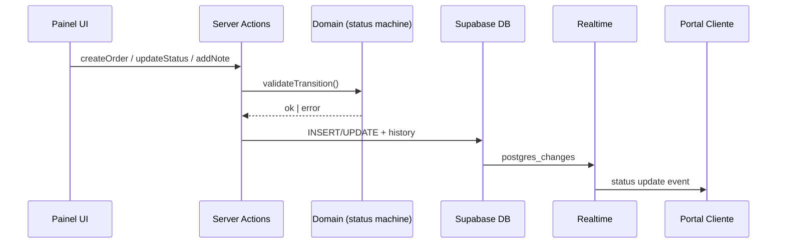

# Gestão de Ordens de Serviço — Design

**Spec**: `.specs/features/ordem-servico/spec.md`
**Status**: Implemented (backend MVP — ver `tasks.md`)

---

## Architecture Overview

Camada de domínio entre UI e Supabase. Server Actions para mutações autenticadas; Route Handlers para consulta pública. Lógica de transição de status isolada em módulo puro testável.



---

## Code Reuse Analysis

### Existing Components to Leverage

| Component | Location | How to Use |
| --------- | -------- | ---------- |
| Supabase server client | `src/lib/supabase/server.ts` | Queries e mutations |
| Database types | `src/types/database.ts` | Tipagem de entidades |
| Realtime hook | `src/hooks/use-order-subscription.ts` | Portal escuta mudanças |

### Integration Points

| System | Integration Method |
| ------ | ------------------ |
| PostgreSQL | Server Actions + RLS |
| Realtime | Trigger automático via postgres_changes |
| Auth | `workshop_id` derivado de `workshop_users` na sessão |

---

## Components

### Status Machine

- **Purpose**: Validar transições de status permitidas
- **Location**: `src/lib/domain/status-machine.ts`
- **Interfaces**:
  - `canTransition(from: ServiceOrderStatus, to: ServiceOrderStatus): boolean`
  - `getAllowedTransitions(from: ServiceOrderStatus): ServiceOrderStatus[]`
  - `getStatusLabel(status: ServiceOrderStatus, locale?: 'pt-BR'): string`
- **Dependencies**: Nenhuma (funções puras)
- **Reuses**: spec.md fluxo de status

### Order Service (Server Actions)

- **Purpose**: CRUD e operações de negócio em ordens
- **Location**: `src/lib/actions/orders.ts`
- **Interfaces**:
  - `createOrder(data: CreateOrderInput): Promise<ActionResult<ServiceOrder>>`
  - `updateOrderStatus(orderId: string, newStatus: ServiceOrderStatus): Promise<ActionResult>`
  - `addOrderNote(orderId: string, content: string): Promise<ActionResult<OrderNote>>`
  - `getOrders(filters?: OrderFilters): Promise<ServiceOrder[]>`
  - `getOrderById(orderId: string): Promise<ServiceOrder | null>`
- **Dependencies**: Supabase server client, status machine, auth session
- **Reuses**: Zod schemas para validação

### Public Order API

- **Purpose**: Consulta pública de ordem via token (sem auth)
- **Location**: `src/app/api/public/orders/[token]/route.ts`, `src/lib/public/order-details.ts`, `src/lib/supabase/public-server.ts`
- **Interfaces**:
  - `GET /api/public/orders/[token]` → `{ order, history, notes }`
- **Dependencies**: Supabase anon client, RLS policies anônimas
- **Reuses**: Tipos compartilhados

### Order Lookup (Consulta por OS)

- **Purpose**: Buscar ordem por número + telefone
- **Location**: `src/lib/actions/public-lookup.ts`, `src/lib/utils/phone.ts`, `src/lib/utils/lookup-rate-limit.ts`
- **Interfaces**:
  - `lookupOrder(orderNumber: string, phoneLast4: string): Promise<ActionResult<{ token: string }>>`
- **Dependencies**: Supabase, normalização de telefone
- **Reuses**: Rate limiting simples (in-memory ou Supabase)

---

## Data Models

### CreateOrderInput

```typescript
interface CreateOrderInput {
  order_number: string
  customer_name: string
  customer_phone: string
  device: string
  brand: string
  model: string
  reported_issue: string
}
```

### OrderWithDetails (resposta pública)

```typescript
interface OrderWithDetails {
  order: ServiceOrder
  history: StatusHistory[]
  notes: OrderNote[]
}
```

### Status Labels (pt-BR)

```typescript
const STATUS_LABELS: Record<ServiceOrderStatus, string> = {
  received: 'Recebido',
  in_analysis: 'Em análise',
  in_repair: 'Em reparo',
  waiting_parts: 'Aguardando peça',
  ready_pickup: 'Pronto para retirada',
  delivered: 'Entregue',
}
```

---

## Database Triggers

### Auto-history on status change

Trigger `on_service_order_status_change` AFTER UPDATE on `service_orders`:
- Se `NEW.status != OLD.status`, INSERT em `status_history` com `from_status`, `to_status`, `changed_by` (auth.uid())

Isso garante histórico mesmo se update vier de outro caminho no futuro.

---

## Error Handling Strategy

| Error Scenario | Handling | User Impact |
| -------------- | -------- | ----------- |
| Transição inválida | Domain error code `INVALID_TRANSITION` | "Não é possível alterar de X para Y" |
| OS duplicada | Unique constraint | "Número da OS já existe" |
| Ordem não encontrada | 404 | "Ordem não encontrada" |
| Nota muito longa | Zod validation | "Máximo 500 caracteres" |
| Rate limit lookup | 429 | "Muitas tentativas. Aguarde alguns minutos." |

---

## Tech Decisions

| Decision | Choice | Rationale |
| -------- | ------ | --------- |
| Mutations | Server Actions | Co-localizado com App Router; type-safe |
| Histórico | DB trigger + app layer | Redundância segura; trigger como safety net |
| Consulta pública | Route Handler REST | Cacheable; separado de Server Actions auth |
| Validação | Zod schemas | Compartilhável client/server |

---

## Validation Schemas (Zod)

```typescript
const createOrderSchema = z.object({
  order_number: z.string().min(1).max(20),
  customer_name: z.string().min(2).max(100),
  customer_phone: z.string().min(10).max(15),
  device: z.string().min(2).max(50),
  brand: z.string().min(1).max(50),
  model: z.string().min(1).max(50),
  reported_issue: z.string().min(5).max(500),
})

const addNoteSchema = z.object({
  content: z.string().min(1).max(500),
})
```
